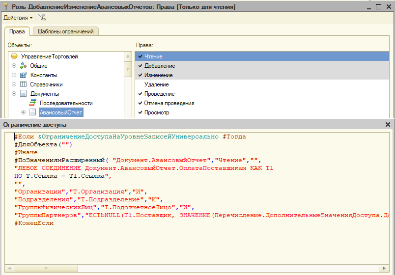
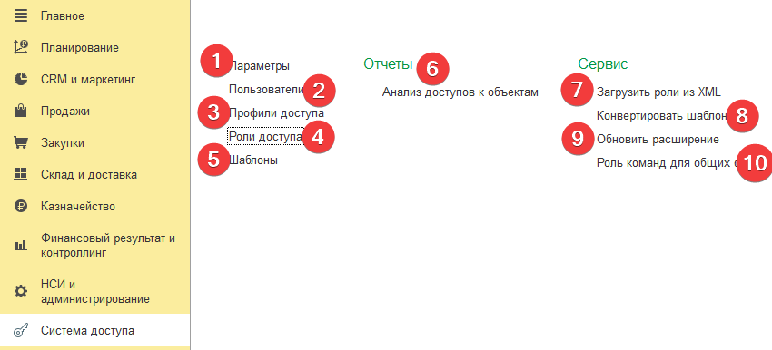

## Немного про проблемы, которые мы хотели решить этой подсистемой

Представим себе ситуацию, что у нас есть некая конфигурация, типовая, или нет – не важно. И представим себе, что у нас реально возникает много проблем, связанных с ролями. Ну как минимум, давайте перечислим основные:

1. Нельзя прочитать RLS, т.е. внедренец ставя ограничение на роль – вообще без понятия о том, что там эта роль реально ограничивает и по каким правилам. Например, есть некая роль:

    

    Глядя на нее в конфигураторе - можно прочитать текст ограничения, и понять, как оно сработает. Но, из режима предприятия - оно не доступно.

    Роли, при наличии БСП, хоть и являются «универсальными», однако, они все равно не перекрывают все потребности. А особую сложность в понимании несут роли, которые дают доступ к разным объектам. Т.е. надо четко уметь отделить некое право, и посмотреть – какие роли его дают. В идеале – одна роль, дает одно право.
2. В конфигурациях бывают баги, а бывают тонкости, про которые далеко не все знают, например, одна роль на чтение может иметь РЛС на некий справочник, а совсем левая роль на изменение (от другой подсистемы), может к этому справочнику давать безусловное чтение. Баг это, или фича, не важно, но такое есть, и хорошо бы такое отлавливать.
3. Отдельное счастье – отладка RLS, что сейчас в принципе невозможно, так как язык RLS – он не тот же самый язык 1С (BSL), и просто написать – не всегда получится.
4. Любое изменение роли – требует лезть в конфигуратор. Любое добавление – роли, надо идти в конфигуратор, надо тестировать под пользователем, открывать все параметры сеансов, смотреть что где, в общем трешь.
5.  И когда выходит обновление конфы – надо перепроверять, не обновились ли шаблоны, и если они обновились, то тогда надо вот в те новые 10 ролей идти, и перекидывать шаблоны, обновлять каждую роль.
6.  История изменения ролей. Кто, когда, зачем и на кой черт попросил что-то поправить. Т.е. т.к. роли добавляет программист, то он берет все входные данные и группирует их, а потом идет делает новые роли, или модификацию предыдущих, и вот потом разобраться – зачем была та или иная модификация, или же – какая модификация была на какую-то там дату – это не реально, разве что в задачниках, но и там надо каждый чих отслеживать, и как-то группировать, чтобы найти. Конечно, если у вас есть git, то немного проще, но лучше, когда к этой истории можно получить доступ не только вам, но и другим.
7.  Ну и мой самый любимый прикол – это когда тебе попадается в руки УТ10, УТП и им подобные, где уже никто ничего не понимает, что творится в ролях, никакого анализа адекватного нету, и пользователей просто создают «по аналогии», так как там изначально всего десяток ролей.
8.  И с типовыми тоже проблем куча, когда есть роли, которые дают не те права, что ты ожидаешь, и хотелось бы проанализировать сами профили, чтобы понять - где что происходит, и что будет в конце.
9.  Доплнительно, сюда же добавились проблемы EDT, которые связаны с тем, что EDT не хило так тратит время на рассчет этих сотен ролей, из-за чего тупит не плохо так.

## Принятое решение
Итого, была поставлена задача по написанию принципиально нового подхода к разработке ролей:

1.  Это будет внешняя подсистема, отсутствие которой никак не скажется на конфигурацию. Т.е. модульность.
2.  Подсистема должна быть универсальной, и не привязываться, практически ни к каким модулям конфигурации или ее объектам.
3.  Основные функции системы – анализ ролей, отладка правил, создание новых ролей, хранение истории изменения ролей и т.д.

И такая подсистема была создана.

Вся суть работы с подсистемой - описывается в пару шагов:

1. Подключение расширения к конфигурации
2. Загрузка ролей из XML текущей конфигурации
3. Создание новых ролей
4. Авто генерация нового расширения с новыми ролями
5. Назначение новых ролей пользователю теми же механизмами, которыми назначаются новые роли просто созданные в конфигураторе.

# Как это все выглядит?

## 1. Подключается новое расширение, возьмем для примера УТ11:

   1.  Параметры, пока оставим их, но суть в том, что можно создавать свои параметры сеанса.
   2.  Пользователи – это просто сам справочник пользователей, из основной конфигурации.
   3.  Профили доступа – этот справочник, по сути, аналогичен типовым из БСП, там просто есть таблица с ролями, и это позволяет комбинировать роли для конкретного пользователя, например.
   4.  Роли доступа — это справочник самих ролей, вот прям ролей, которые есть в конфигурации.
   5.  Шаблоны – это шаблоны ролей. У 1С в конфигурации нет единого объекта шаблонов ролей, а на каждую роль – идет свое, однако, в нашем случае – это единый общий справочник.
   6.  Отчет, который позволяет проанализировать роли.
   7.  Загрузка данных ролей из XML.
   8.  Конвертация шаблонов в код BSL.
   9.  Генерация и подключения расширения с новыми ролями.
   10. Используется для обычных форм, это просто обработка с теми же 3 кнопками, что и выше.

## 2. Идем в опцию загрузки ролей "Загрузка данных ролей из XML" , и загружаем роли:
При открытии - программа определит текущее подключение и заполнит настройки:


Можно указать и другие настройки, если выгрузка идет с другой базы, например. 

При загрузке, если что-то пойдет не так, то программа покажет лог. Status отличный от нуля - значит произошла ошибка.

Если есть ранее выгруженная конфигурация в XML файлы (это можно сделать  зайдя в конфигуратор, и выбрав меню "Конфигурация - Выгрузить конфигурацию в файлы", или же есть конфигурация в исходниках формата EDT, то можно выбрать третий пункт - "XML файлы конфигурации" и указать путь к верхней папке, т.е. внутри этот папки должна быть папка Roles, по сути, только она и нужна, остальные папки не сканируются.


<details>
  <summary>Команда выгрузки конфигурации в XML</summary>
При выборе типа соединения с базой, если выбран тип SQL или Файловая база, то будет выполнена вот эта команда конфигуратора:

```bsl
    CommandToUploadExt = """" + BinDir() + "1cv8.exe"" designer " + "/N """ + Settings.Login + """" +
        " /P """ + Settings.Password + """" + " " + 
        ?(Settings.Source = "SQL", "/s " + Settings.ServerName + "\" + Settings.BaseName, "/f " + Settings.Path) +
        " /DumpConfigToFiles " + Path + " /DumpResult " + Path + 
        "\Result.log /DisableStartupMessages /DisableStartupDialogs /Out " + Path + "\Event.log";
    RunApp(CommandToUploadExt, , True);
```
</details>
 
<details>
  <summary>Определение уникальности роли </summary>
Тут надо было решить несколько задач.

Первая – не загружать те роли, которые уже по факту были загружены и не изменились.

Для этого мы воспользовались технологией хешей, а именно, вначале происходит чтение текстового файла, потом считается его хеш вот такой вот функцией:
```bsl
    Function HashMD5(Data) Export
        Hash = New DataHashing(HashFunction.MD5);
        Hash.Append(Data);
        HashSum = Hash.HashSum;
        HashSumString = String(HashSum);
        HashSumString = StrReplace(HashSumString, " ", "");
        HashSumStringUUID = Left(HashSumString, 8)      + "-" +
                            Mid(HashSumString, 9, 4)    + "-" +
                            Mid(HashSumString, 15, 4)   + "-" +
                            Mid(HashSumString, 18, 4)   + "-" +
                            Right(HashSumString, 12);
        Return HashSumStringUUID;
    EndFunction
```
Она возвращает строку, которую можно преобразовать UUID. Можно, конечно, передавать сам бинарник, тогда как бы и не надо было бы читать файл, однако, нам все равно из файла надо получить UUID роли, чтобы сопоставить с тем, что в базе.

И этот же UUID из ролей – является UUID элемента справочника ролей. Поэтому, если вы по какой-то причине потеряли эти UUID, а их можно иногда потерять, например, при слиянии конфигураций по наименованию, а не ID объектов. То тогда можно получить дубли.
</details>

<details>
  <summary>Особенности галочки "Устанавливать права для новых объектов"</summary>
Дошли мы до этапа загрузки данных, и тут оказывается один момент, есть в правах доступа такие хитрые галочки:


Хотелось бы в них разобраться подетальнее.

Например, на [ИТС](https://its.1c.ru/db/v8317doc#bookmark:dev:TI000000189) про эти галочки говорится следующее:

Состояние флажка ```Устанавливать права для новых объектов``` определяет, будут ли установлены права для этой роли на новые добавляемые объекты конфигурации (снят по умолчанию для новой роли).

Состояние флажка ```Устанавливать права для реквизитов и табличных частей по умолчанию``` определяет, будут ли установлены права для этой роли на реквизиты (включая стандартные) и табличные части (включая стандартные) для новых объектов конфигурации (установлен по умолчанию).

При изменении состояния флажка ```Устанавливать права для реквизитов и табличных частей по умолчанию``` система предлагает изменить (установить или сбросить) права доступа для всех реквизитов (включая стандартные) и табличных частей (включая стандартные) всех объектов конфигурации.

И тут получается какая особенность, с одной стороны - галочка про новые права нужна, и понятна, т.е. поставили полным правам эту галочку, и больше не мучаемся, но, как оно работает на самом деле?

Давайте проведем эксперимент, создадим конфу с двумя справочниками и тремя ролями:


И выгрузим их в XML, и проведем анализ, что же на самом деле происходит. Мы создали три роли, сняли все права, и установили все права только на справочники.

Вторая и третья роль полностью совпадают, что логично, а вот что произошло с первой и второй?


Т.е. в конфигурации, по факту, хранится информация о том, что во второй роли доступно, а в первой - запрещено.

Теперь давайте у обоих ролей отменим доступ ко второму справочнику, и выгрузим их опять.


Обратите внимание, что первая роль фиксирует у себя явный запрет к стандартным реквизитам ```Справочник2```, и остальные доступы к объекту тоже (1 и 2 область), в третьей области ничего не изменилось, однако, вторая роль, тоже фиксирует явный запрет доступа к стандартным реквизитам Справочник2 (область 4).

Теперь давайте добавим справочник 3, а в ролях ничего менять не будем, и после выгрузки, мы увидим, что ничего не поменялось. Но при этом, у второй роли есть доступ к стандартным реквизитам, хотя, объект просто был создан ```Справочник3```, и ничего не менялось более.

Какие выводы можно тут сделать:

1. На самом деле, галочка ```Устанавливать права для новых объектов``` ничего не устанавливает, если эта галочка стоит, то роль работает по принципу явного запрета, а без этой галочки - явного разрешения. Т.е. с галочкой - разрешено всё, что не запрещено, без галочки - запрещено все, что не разрешено.

2. Видел пару раз случаи, когда эту галочку ставили по умолчанию, потом явно снимали все права, и давали те что надо, поговаривая при этом, что типо - зато программист не забудет дать права нужные. Или что типо - "Какая разница, если я все контролирую?". Так вот, разница - огромная, если в роли с такой галочкой отменить все права у объектов, и дать доступ к одному справочнику, то в случае УТ11, например, само право доступа будет иметь размер в 11Мб и иметь около 100 000 строк. 100 000 строк КАРЛ!

3. Доступы к стандартным реквизитам - не подчиняются общим правилам, и всегда фиксируется отдельно. Похоже на то, что ранее, система не имела возможность ставить такие права, и для обратной совместимости, эти права ставятся отдельно и явно.

Возможно, кто-то уже про это знал, но для меня это было некоего рода открытием.
</details>

## 3. Анализируем роли
Давайте откроем какую-то роль, и посмотрим - что там?


Изначально, открывается отчет, который позволяет просто сделать быстрый беглый анализ того, что дает, или запрещает эта роль. Т.е. тут четко видно - какие права доступа дают, какие RLS при этом действуют и т.д.

<details>
  <summary> Остальные закладки дают дополнительную информацию по роли</summary>
Кроме этого, тут же видно какие шаблоны есть в этой роли, и их тут же можно прочитать:


Какое название роль имеет на разных языках, и тут же, можно указывать названия, которые вы хотите дать, созданой роли:


Сводная информация по роли, так сказать "внутренности хранения", где в целом видно - что на что действует, и можно сохранить куда то для анализа:


</details>

И, самое главное - матрица ролей:


Это то место, где можно проводить точечный анализ роли, или, создать новую роль, или же - модифицировать ранее созданную.

По умолчанию - выводятся только те объекты, к которым дан доступ, однако, если надо добавить объекты, то в этом случае - можно выбрать опцию "Все объекты" и нажать кнопочку "Обновить права", тогда матрица перестроится.

И вот тут у нас есть много всего рассказать людям, про проблемы, с которыми мы столкнулись, как решали, и какие решить не смогли.

 
<details>
  <summary>Вводная по особенностям</summary>
 В основном, все проблемы крутятся в данном случае вокруг того, что для 1С тут слишком много данных выводится, например, в случае УТ11, если показать все объекты, то программа должна будет вывести 35 000 строк объектов, и все это умноженное на 86 колонок, или, другими словами - около 3 000 000 ячеек.

 
<details>
  <summary>Зачем нужен макет на первой вкладке, если он дублирует матрицу?</summary>
  Ответ прост, потому что в табличный документ все выводится быстрее, чем в древо значений, однако, за счет условного оформления - работать с деревом значений значительно проще, чем с табличным документом. Именно поэтому - модификация происходит в древе значений, а не макете, а макет используется для экспресс анализа.
</details>
 
<details>
  <summary>Контекст и БезКонтекста</summary>
 Тут позволю себе еще раз остановиться, и всем напомнить о том, как важно дергать функции, если они нужны - в безконтекстных вызовах. Изначально, все тесты мы делали на простой конфе, где есть каждого объекта по одному типу, и вроде как все летало, но, как только пришла ERP - все рухнуло, а так как мы изначально забыли (читай - забили), то потом пришлось переписывать реально много кода.
</details>

<details>
  <summary>Условное оформление на 80+ ячеек</summary>

При таком объеме данных - все работает отлично. В системе находится 250 правил. Как реализовано все это в таблице, особенно те моменты, где права можно назначать только те, которые поддерживает текущий объект.

1. Вначале на все ячейки ставится условие - ```Доступность = Ложь```
2. Выполняется условие, которое проверяет типы объектов и открывает доступность только тем правам, которым надо
3. На все остальные роли накладывается фон цвета - запрет
4. После этого накладывается условие на замену текста на кружок, и установка его цвета.

И если первый пункт, второй и третий - делался вручную, то четвертый, де просто говорится, что если ```Таблица.Чтение = 1```, тогда поставь зеленый кружок, и заполни поле ```Чтение```, ```Если Таблица.Чтение = 2```, то поставь красный крек и заполни ```Чтение```, и т.д., около ```70 прав \* 3 = 210 случаев```, то вот это уже делать было совсем не весело.

Как решена была эта проблема - конфигурация была выгружена в XML, в XML найдена форма, там скопирован пример заполнения одного поля, и потом просто написана за 5 минут обработка, которая бежит по все колонкам, и копирует этот пример столько раз, сколько надо. И после этого - результат вставили в XML, и загрузили конфу.

Не забывайте про этот лайфхак. На самом деле - это расширение создано в EDT, и там даже выгружать ничего не надо, просто открыл VCS, заменил чего надо, сохранил, EDT сразу переформатировало, и все, 5 минут времени.
</details>
 
<details>
  <summary>Всякие иконки 🌹🎉🎶🤦‍ ...</summary>

 Не забуду напоминать - если у вас Windows 10, то нажмите ```Win + .``` (русская Ю) и печатайте всякое - 🌹🎉🎶🤦‍👍💕😂😊. Не все символы поддерживает 1с, и не все так выводит как и тут, но многие вещи решить таки позволяет. Но учтите, что на вебе и тонком - все может разница, так что проверяйте, и даже на разных браузерах - все может выглядеть по разному.
</details>
 
<details>
  <summary>Оптимизация работы с областями табличных документов</summary>
Логика вывода макета построена на классических макетах. Т.е. есть некий общий макет, который содержит в себе области с именами, и выводя отчет - надо получать эту область, и ... выводить в документ.

Все очень просто. однако, в этой области находится 70 колонок и столько же параметров, а еще она разукрашена, и получилась такая интересная вещь, что получение этой области - занимало порядка 15% времени, судя по замеру производительности.

И казалось бы - надо как-то захешировать эти данные, и тут было потрачено не мало времени, пока не стало очевидно, что адекватными путями - эту проблему не решить.

Т.е. варианты:

1. скопировать область в переменную - не работает, так как нет такого понятия, как копирование табличного документа.
2. Положить в хранилище, а потом постоянно дергать - тоже не вариант, так как табличный документ - это не простой тип, и 1С работает с адресом в памяти, т.е. меняя эту область где угодно - меняться будет везде.
3. По этой же причине - не спрятать ее в массиве, структуре или временном хранилище
4. По этим же причинам - не передать ее в процедуры/функции в качестве параметра с описанием Знач
5. Вариант сериализации и дальнейшей дисериализации - помогает, но по времени столько же, сколько и просто получение области, что, в принципе логично.
6. И, как следовало бы ожидать - общий модуль, с параметром переиспользования значений, тоже нам ничем не поможет, так как модифицируя полученную через него область, она меняется в памяти по адресу. Но действительно ли повторное использование нам ничем не поможет?

**Давайте рассмотрим несколько вариантов:**

1. Для получения каждой области - мы дергаем функцию общего модуля, которая возвращает следующее:
```bsl
    Return GetCommonTemplate("Roles_MatrixTemplate").GetArea("Row");
```
В этом случае - отчет по всем ролям в УТ11 строится за 150 секунд, из которых вот эта часть занимает 35% времени:


2. Вынесем получение макета в модуль, где идет возврат повторноиспользуемых значений, ну или просто определим его в переменную, и тут видим, что прирост стал приличным, эта функция теперь выполняется за 17% времени:


3. Но идем дальше, а что, если мы просто будем очищать область каждый раз, перед ее использованием. В этом случае, нам надо прописать нечто вроде такого кода:
```bsl
    Function RowTemplate() Export
        Template = Roles_SettingsReUse.MatrixTemplates_Rows();
        For Index = 0 To Template.Parameters.Count() - 1 Do
            Template.Parameters[Index] = Undefined;
        EndD;

        Return Template;
    EndFunction
```
Такой код приходит сразу в голову, так в 1С нельзя получить список параметров с именами, по нормальному получить... Но тут выясняется, что код стал работать медленнее, теперь тратиться уже 20% времени.


Можно было бы плюнуть, и оставить второй вариант, ибо все таки там 35 000 вызовов, а тут цикл на 2 000 000 + итераций, ясное дело будет медленее, однако, не давала покоя одна мысль, а именна - функция у параметров заполнить. Но она работает то только с именами... Поэтому был придумал 4 вариант.

4. В общем модуле с переиспользованием размещаем вот такой код:
```bsl
    Function MatrixTemplates() Export
        Return GetCommonTemplate("Roles_MatrixTemplate");
    EndFunction

    Function MatrixTemplates_Rows() Export
        Str = New Structure;
        Str.Insert("Template", Roles_SettingsReUse.MatrixTemplates().GetArea("Row"));
        Params = New Structure;
        For Index = 1 To Str.Template.TableWidth Do
            Cell = Str.Template.Area(1, Index);
            Params.Insert(Cell.Parameter);
        EndDo;
            
        Str.Insert("Params", Params);
        
        Return New FixedStructure(Str);
    EndFunction
```
В обычном общем модуле размещаем такой код:
```bsl
    Function RowTemplate() Export
        Str = Roles_SettingsReUse.MatrixTemplates_Rows();
        Template = Str.Template;
        Template.Parameters.Fill(Str.Params);
        Return Template;
    EndFunction
```
И вуаля,**производительность выросла в 15 раз, 15 раз! Относительно 2 варианта, и в 30 раз - относительно первого**


</details>
<details>
  <summary>Не забываем про индексирование колонок в таблице значений, ускоряемся на порядок</summary>

Во время очередной оптимизации, мы столкнулись с тем, что у нас идет поиск по 2 полям внутри таблицы значений, и этот поиск занимал 66% времени формирования отчета.

Когда же мы задались оптимизацией, то думали - как можно ускорить поиск, думали о том, что найдены строки в итерации - надо удалять, тогда поиск будет быстрее, но все равно - это реально много времени. А потом выяснили, что мы просто забыли проиндексировать поля поиска в таблице значений, когда мы добавили индексы, то поиск ускорился с ```80 секунд, до 0,2```. Т.е. на полтора порядка. И в целом, отчет стал строится не 120 секунд, а 25 секунд. И всего то, надо было добавить индекс в таблицу значений.

Не забывайте про это. А я в реальности вижу это очень часто. Когда, например, идет загрузка из Excel в базу товара, то парсят Excel, делают его таблицей значений, а потом делают поиски в нем по штрихкодам, или ценам, особенно если в экселе 2 страницы, которые надо связать. А индексы не ставят, и когда товара становится много, то поиск по таблице жрет половину времени загрузки.

Но, общаясь с коллегами, я их спросил - а как вы ставите индекс, и был немного удивлен, щас поясню.

Есть у нас некая ТЗ, и в ней есть колонки: ObjectPath, ObjectName, Disable ... и еще куча других, но поиск выполняется по этим трем. Когда я спросил - как вы ставите индекс, при условии, что мне надо выполнить поиск вот такими функциями:
```bsl
    RightTable.FindRows(New Structure("ObjectName, Disable", MetaItem.Name, False))
```
И
```bsl
    RightTable.FindRows(New Structure("ObjectPath, Disable", MetaItem.Name, False))
```
В ответ я получил два варианта:
```bsl
    RightTable.Indexes.Add("ObjectPath");
    RightTable.Indexes.Add("Disable");
    RightTable.Indexes.Add("ObjectName");
```
и второй вариант:
```bsl
    RightTable.Indexes.Add("ObjectPath, Disable, ObjectName");
```
И когда началось выяснение - почему так, то оказывается, что большинство из них не знало, что в 1С, на таблицу значений идут составные индексы, т.е. все эти добавления индексов - бесполезные, даже более - они вредят.

Правильный ответ был такой:
```bsl
    RightTable.Indexes.Add("ObjectPath, Disable");
    RightTable.Indexes.Add("ObjectName, Disable");
```
Мало того - тут важен порядок колонок, он должен быть строго такой, в котором идет поиск. И желательно - первый параметр должен отсекать максимум, т.е. по правильному - я неправильно задал условие, так как первый параметр является булево, то он должен был идти впереди, а потом только строковый параметр, но я не уточнял это в условии, так что не обращаем на это внимание.
</details>
</details>

## 4. Справочник профилей


На самом деле - это справочник, в котором просто собираются разные роли, по типу такого же справочника в типовых, на БСП. Однако, этот справочник более ничего не делает. Он позволяет только делать анализ.

Если конфигурация написана на БСП, то в этом случае - можно скопировать профили из текущей конфигурации сюда, для этого есть специальная кнопка:


И давайте откроем любой профиль:


Тут видно, что есть галочки разных вариантов, простая галочка - говорит что доступ к этому праву этого объекта дает ТОЛЬКО ОДНА роль. Что по-хорошему и должно быть.

В случае галочки в черном квадрате - это значит, что несколько ролей дают доступ, причем как видите - ниже пишется сам RLS, который ограничивает чтение. Однако, обратите внимание на то, что роль перечеркнута - это значит, что одна из ролей которая дает доступ к этому объекту по этому праву - не имеет RLS, т.е. в этом профиле - не будет действовать ограничение по этому регистру на чтение.

Так же - справа подсвечиваются зеленым цветом те роли, которые, собственно, и дают это самое право.

<details>
  <summary>Еще несколько особенностей этого отчета</summary>

 

Вот так отчет выглядит в целом, желтый цвет означает, что в группе есть объекты, которым дано право, и те объекты, которым оно не дано.


Галочки в таблице ролей говорят о том, что данная роль будет скрыта из отчета, т.е. всегда можно "не отходя от кассы" скрыть не нужные роли, и посмотреть - а что же будет в итоге.


Для того, чтобы пользователь не ошибся - отчет у него по тем ролям что справа, или он забыл обновить его, то при любом изменении правой таблицы - отчет переводится в черно-белый режим. Не помню, где это подсмотрели, но идея зачетная :)


Так как ролей в профиле может быть реально много, то вверху есть галочка - "Показывать все роли", если ее снять, то справа остаются только те роли, которые дают конкретное право на конкретный объект.
</details>


##  5. Отчет по правам доступа
Однако, очень часто возникают задачи - узнать, какие роли дают право доступа к конкретному объекту, и с какими ограничениями.
Например, прилетела задача - нам надо сделать пользователю роль, где он сможет читать возвраты клиентов с отбором по подразделению. Возникает вопрос - а есть ли вообще такая роль?
Значит идем, и формируем отчет:


Указывает часть пути к объекту, который нас интересует, это может быть любая часть из примера строки:
```bsl
    InformationRegister.ОчередьСообщенийИСМП.StandardAttribute.Active
```
Т.е. идет поиск по вхождению, и есть стоит отдельное право на разрешение или запрет чтения реквизита, то и по реквизитам тоже поиск может делать.
Далее можем указать подтип объекта, это имеет смысл делать если нас интересуют права на реквизиты, табличные части и т.д.
После этого можем указать тип объекта - документ, справочник и т.д.
И в завершение можем указать само право. Что мы и сделаем, так как вывелось сильно много информации.
Тогда отчет будет выглядеть вот так:


Тут сразу видно - какие роли дают доступ к документу, в каких профилях они находятся, и какие RLS их ограничивают.

Т.е. сразу понятно - что к чему.

И мы сразу видим, что роль, которая нас интересует - это роли ```ДобавлениеИзменениеВозвратовТоваровОтКлиентов``` или ```ЧтениеВозвратовТоваровОтКлиентов```.

<details>
  <summary>Вывод картинок в отчете</summary>
 Начиная с некой версии 1С, вроде 8.3.14 - появилась возможность нормально выводить картинки в отчет, а тут эта задача стояла очень остро, так как без картинок нифига не понятно, а картинки выводит по старому (ну там через парсинг макета и т.д.) - задача была обречена на провал, так как их тут тонна.

В итоге, получилось сделать весьма элегантно:

В самом отчете прописаны были вот такие вычисляемые поля:


Тут надо обратить внимание на оформление, и на тип значение. Модуль, как видно из названия - повторного использования, и там находится вот такой код:
```bsl
    Function RightPictureByRef(RefData) Export
        If ValueIsFilled(RefData) Then
            Name = MetaNameByRef(RefData);
            Return New ValueStorage(PictureLib["Roles_right_" + Name].GetBinaryData());
        Else
            Return New ValueStorage(New Picture);
        EndIf;
    EndFunction
```
По сути, в функцию передается ссылка на перечисление, по ссылке ищется имя перечисления как оно задано в конфигураторе, потом идет поиск картинки, получаем ее бинарник, помещаем в хранилище значений, и возвращаем в отчет.

В самом отчете это выглядит вот так:


И это все позволяет еще вывести вот такую красивую легенду:


Так что - на забывайте про эти механизмы.
</details>
  
## 6. Анализ и дебаг RLS

Все было бы скучно, если бы мы ограничились только просмотром, а что если нам поставили задачу, и сказали - сделайте ограничение, чтобы некий пользователь мог видеть только заказы, вне статуса Закрыт. Т.е. все не закрытые заказы. Это на самом деле становится не редкой задачей, в связи с мобильным клиентом, когда надо максимум всего скрыть в угоду производительности.

И тут у нас два пути - первый, если мы говорим про БСП, то все сделать стандартами ограничения БСП, где прописать параметр ограничения, сделать запуск обновления и кучу всяких других действий, а можем пойти просто - скопировать роль, и просто дописать в ней условие.

По такому же принципу как и ранее - мы находим нужную нам роль, это будет роль -```ДобавлениеИзменениеЗаказовКлиентов```.

Копирую роль в справочнике ролей и пишу другое название, например -```ДобавлениеИзменениеЗаказовКлиентовСЧтениемПоСтатусу```, и не забываю переименовать на вкладке наименований, а то иначе у меня будет две роли с один и тем же синонимом.

Идем в матрицу ролей, находим нужное место и видим RLS:


Нам надо дописать условие, и если мы четко знаем как это сделать - то можем это написать прям тут. Однако, я не помню где и как это прописывать. Допустим, я хочу задать вот такой вот код:
```bsl
    #Если &ОграничениеДоступаНаУровнеЗаписейУниверсально #Тогда
    #ДляОбъекта("")
    #Иначе
    #ПоЗначениям( "Документ.ЗаказКлиента","Чтение","",
    "Организации","Организация",
    "Склады","Склад",
    "ГруппыПартнеров","Партнер",
    "Подразделения","Подразделение", 
    "НЕ Статус = ПредопределенноеЗначение("Перечисление.СтатусыЗаказовКлиентов.Закрыт")","", "","", "","", "","", "","", "","", "","", "","", "","", "","", "","", "","" )
    #КонецЕсли
```
Итого - дописали вот такую строку:
```bsl
    НЕ Статус = ПредопределенноеЗначение("Перечисление.СтатусыЗаказовКлиентов.Закрыт")
```
Однако, как проверить - правильно ли я написал?

Для этого - открываем этот RLS по кнопочке "Открыть", прям в этом поле и вижу вот такую картинку:


Тут все просто:
1. Имя текущей таблицы - по умолчанию, это имя текущего объекта
2. Имя доступа - берется из матрицы, обычно это Чтение, Изменение, Удаление, Добавление.
3. Поговорим позже. Отвечает за ситуацию, когда вы используете в RLS параметры сеанса, но они должны быть не теми, которые сейчас.
4. Сам текст RLS
5. Шаблоны, которые привязаны к текущей роли
6. После  нажатия кнопки "Конвертировать в запрос" - вы получаете результирующий код запроса. И обратите внимание - 1С внизу мне вывело текст ошибки, это значит, что можно уже не перезаходить в базу под кем-то, ибо работать все равно не будет.
7. - 10. - используются для формирования запроса. Обычно в 7 пишут что типо:
```bsl
    Т ГДЕ
```
А в 8:
```bsl
    Выбрать Т.Ссылка Из Документ.ЗаказКлиента Как Т ГДЕ
```
Т.е. мы формируем валидный запрос.

11. Выводится результат запроса.

Исправляем ошибку:
```bsl
    #Если &ОграничениеДоступаНаУровнеЗаписейУниверсально #Тогда
    #ДляОбъекта("")
    #Иначе
    #ПоЗначениям( "Документ.ЗаказКлиента","Чтение","",
    "Организации","Организация",
    "Склады","Склад",
    "ГруппыПартнеров","Партнер",
    "Подразделения","Подразделение", 
    "","НЕ Статус = ПредопределенноеЗначение(Перечисление.СтатусыЗаказовКлиентов.Закрыт)", "","", "","", "","", "","", "","", "","", "","", "","", "","", "","", "","" )
    #КонецЕсли
```
Т.е. перенесем во второй параметр условие, и уберем кавычки, так как в запросе они не нужны.

Теперь программа вернет "нормальный" текст запроса:


Пробую выполнить, и получаю ошибку, естественно. Т.е. система не позволит допустить даже такие ошибки. Исправляю ошибку, меняю "**ПредопределенноеЗначение**", на просто "**Значение**", нажимаю "**Конструктор запросов**" и выравниваю запрос, и сразу могу его выполнить.

Однако, если его выполнить, то БСП вернет пустой список, так как у пользователя *Администратор*- нет никаких настроек в БСП.

Для исправления этой ситуации - переходим на вкладку **Параметры сеанса**, и установлю параметр *АвторизованныйПользователь* в значение тестируемого пользователя, в моем случае это - *Гладилина Вера Михайловна*, менеджер. Далее, необходимо поставить галочку "**Использовать параметры сессий из таблицы**" и теперь можно выполнить запрос:


<details>
  <summary>Дебаг и конвертация RLS в BSL</summary>

Однако, ситуации бывают много сложнее, иногда не понятно - почему то или иное условие не выполнилось. И чтобы разобраться с этим - можно перейти на вкладку отладки:


Тут идет развертывание всего цикла выполнения запроса. Т.е.:

1. Условие которое проверяется
2. Текст условия проверки
3. Результат - условие выполнилось или нет
4. Код, который будет взят, если условие выполнилось
5. Статус выполнения. Он показывает, что именно этот код будет взят, например, у нас может быть 5 условие ЕслиИначе. Результат может показать, что все 5 были выполнены, но в итоговый результат попадет только то, где стоит флаг статус.
6. Если будет ошибка, то она попадет сюда.
7. Расшифровка поля 2.
8. Расшифровка поля 4.

Однако, возникает ситуация, когда и с этим кодом разобраться не реально, так как 6000 строк анализировать таким путем - задача не тривиальная.

Своего отладчика у RLS нет, однако, что если мы просто конвертнем код RLS в код BSL, к которому мы привыкли, и таким образом просто обычным отладчиком все проверим?

Тогда идем на вкладку BSL код и видим пару кнопок:


1. Конвертирует RLS в BSL код, который можно выполнить прям тут.
2. Выполнение кода BSL
3. Конвертирует во внешний код, который можно вставить во внешнюю обработку.
4. Собственно сам BSL
5. Результат выполнения BSL.

Ну и конечно, при анализе больших RLS - не редко возникает необходимость использования шаблонов, и шаблонов может использоваться 2,3, 5 и более. В таком случае вам поможет вкладка RLS просмотр, которая вернет результирующий RLS, со всеми шаблонами и т.д.


</details>

## 7. Создание новых ролей в конфигурации
Окей, роль мы создали, надо теперь ее проверить в действии, но у нас же в конфигурации роли такой нету.
Для начала - нам надо немного обновить эту роль, а именно - всем объектам входящих в нее дать право на просмотр/редактирование стандартных реквизитов, по умолчанию - расширение их не ставит.
Тоже самое касается отдельных реквизитов, если вы хотите в какой-то роли запретить явно работать с неким реквизитом, то в других ролях, которые тоже расширяют этот объект - надо дать явное разрешение. 
Для того, чтобы она там появилась, мы жмем кнопку "Обновить расширение" и меню сервиса нашей подсистемы.

<details>
  <summary>Что происходит в этот момент</summary>
В этот момент генерируется расширение.

Генерация происходит в несколько этапов:

1. Из макета **Roles\_TemplateDB**выгружается во временную папку пустая база с расширением в zip архиве.
2. Архив распаковывается, и выполняется команда, которая выгружает данные расширения в XML
3. XML парсится, и туда добавляются новые роли, добавляются расширяемые объекты, параметры сеанса, если нужны и куча всего другого.
4. XML собирается обратно в cfe
5. cfe подключается в базу.

Почему именно через тестовую базу? Все просто, это позволяет не заморачиваться на разные форматы конфигурации, которые зависят от версии платформы. 
</details>

В этот момент в систему добавляется новое расширение, которое содержит в себе указанную ранее роль.

Далее дело за малым, идем в профили, убираем старую роль и даем новую и все, можем теперь зайти под этим пользователем и убедиться, что все сработало на ура :)

## 8. Свои параметры сеансов

А что, если надо дать этот запрет ТОЛЬКО в том случае, когда мы заходим мод мобильным клиентом, например, а если под стационарным, то все должно быть видно.
В этом случае - нам надо создать свой параметр сеанса, и поставить отбор по нему.
Тогда создаем новый параметр:


Ставим галочку "Использовать код", и прописываем код установки этого параметра:
```bsl
    SessionParameters.AccRoles_isMobileClient = ОбщегоНазначения.ЭтоМобильныйКлиент();
```
Тут есть один нюанс - имя параметра имеет префикс "**AccRoles\_**" и надо не забывать его прописывать.

Функция "ОбщегоНазначения.ЭтоМобильныйКлиент()" возвращает мобильный клиент это или нет. По-другому тут получить не выйдет, так как сервер один и тот же у стационарной и у мобильного клиента, а установка параметров - это серверный вызов. Поэтому просто дергаем функцию из стандартной библиотеки.

Потом идем в роль, и дописываем условие:
```bsl
    #Если &ОграничениеДоступаНаУровнеЗаписейУниверсально #Тогда
    #ДляОбъекта("")
    #Иначе
    #ПоЗначениям( "Документ.ЗаказКлиента","Чтение","",
    "Организации","Организация",
    "Склады","Склад",
    "ГруппыПартнеров","Партнер",
    "Подразделения","Подразделение", 
    "","НЕ Статус = Значение(Перечисление.СтатусыЗаказовКлиентов.Закрыт) 
         OR Not &AccRoles_isMobileClient", 
    "","", "","", "","", "","", "","", "","", "","", "","", "","", "","", "","" )
    #КонецЕсли
```
После этого - обновляем расширение и заходим под тем пользователем, и все. Теперь вод тонким клиентом видны все заказы, а под мобильным - только не закрытые.

Однако, можно было бы и параметры с фиксированными данными создавать, ну типо отбор по конкретной организации или списку, и задать его свой для роли:


Таким образом - эта система позволяет настроить достаточно сложные роли, и создавать свои параметры сеансов, и все это происходит в расширении.

## 9. Обычные формы и расширение

Мы уже говорили о том, что это расширение прекрасно работает и с обычными формами? Условие только одно - совместимость на 8.3.14.

Если говорить про управляемые формы, то там уже достаточно гибкая подсистема прав доступа, а вот с обычными формами - все грустнее.

Давайте возьмем типовую УТ10 и накатим на нее все тоже самое.  

Подключаем расширение, если не нужен английский язык, то удаляем его, если не нужен русский - то удаляем его. В случае ERP - там уже есть английский, поэтому надо просто переименовать с English, на Английский:


И не забываем пользователям дать права, по умолчанию - две роли, для Админа, и для всех остальных пользователей, и у пользователя, у которого обновляем расширение, снимаем защиту от опасных действий, либо отключаем профилями безопасности:


Если все сделано хорошо, то тогда в Операции - Обработка, вы сможете найти обработку с названием "Роль команд для общих форм": 

Открываем ее, нажимаем "Загрузить роли из XML". Закрываем конфигуратор, если он был открыт. Выбираем тип подключения к базе, и заполняем данные, или указываем просто путь к папке, куда заранее были выгружены файлы XML конфигурации.

Жмем "Загрузить роли" и видим, что система подгрузила 18 ролей:


И теперь можем открыть любую роль:


Ну а дальше уже - можно создавать роли, копировать и модифицировать, ставить ограничения и кучу всего другого.

 

# FAQ

Не большой FAQ для разработчиков и тех, кому интересно.

<details>
  <summary>Почему используется выгрузка DumpConfigToFiles вместо DumpConfigFiles с параметром Right?</summary>
 Да, используя первый параметр - мы выгружаем всю конфу, что происходит очень долго, и много места может занимать, но если пользоваться вторым параметром, то тогда мы не сможем получить GUID роли, а значит - если в роли что то поменяется, то мы тогда не сможем их никак соотнести, кроме как по наименованию. Но мы предполагаем, что имя может подменяться, например, старую роль переименовали и добавили префикс, а новую назвали так, как называлась старая и т.д.
</details>
 
<details>
  <summary>Как происходит генерация расширения с учётом кучи свойств?</summary>
Роли в расширениях работают по принципу зависимости от объектов, т.е. если можно расширить форму и просто забить на реквизиты, то все будет работать, мы сможем к ним общаться из расширения и т.д. Однако, в случае ролей - если дается право на таблицу, на реквизит, то тогда этот реквизит обязан быть в конфигурации.

Таким образом - нужен был механизм, который может полностью сгенерировать расширение, и для того, чтобы он работал - достаточно передать пару реквизитов, типо путь объекта, тип объекта и еще несколько.

У разных объектов - есть разные свойства, например, xml справочника выглядит вот так:
```xml
    <?xml version="1.0" encoding="UTF-8"?>
    <MetaDataObject xmlns="http://v8.1c.ru/8.3/MDClasses" xmlns:app="http://v8.1c.ru/8.2/managed-application/core" xmlns:cfg="http://v8.1c.ru/8.1/data/enterprise/current-config" xmlns:cmi="http://v8.1c.ru/8.2/managed-application/cmi" xmlns:ent="http://v8.1c.ru/8.1/data/enterprise" xmlns:lf="http://v8.1c.ru/8.2/managed-application/logform" xmlns:style="http://v8.1c.ru/8.1/data/ui/style" xmlns:sys="http://v8.1c.ru/8.1/data/ui/fonts/system" xmlns:v8="http://v8.1c.ru/8.1/data/core" xmlns:v8ui="http://v8.1c.ru/8.1/data/ui" xmlns:web="http://v8.1c.ru/8.1/data/ui/colors/web" xmlns:win="http://v8.1c.ru/8.1/data/ui/colors/windows" xmlns:xen="http://v8.1c.ru/8.3/xcf/enums" xmlns:xpr="http://v8.1c.ru/8.3/xcf/predef" xmlns:xr="http://v8.1c.ru/8.3/xcf/readable" xmlns:xs="http://www.w3.org/2001/XMLSchema" xmlns:xsi="http://www.w3.org/2001/XMLSchema-instance" version="2.8">
        <Catalog uuid="9c2b82fa-1adc-427f-a0d8-6eaeb2bef2b0">
            <InternalInfo>
                <xr:GeneratedType name="CatalogObject.Банки" category="Object">
                    <xr:TypeId>0ad45a19-1ec2-440a-8751-9f9a658125cb</xr:TypeId>
                    <xr:ValueId>21cc3b2b-46a7-4efe-8458-115eb901e246</xr:ValueId>
                </xr:GeneratedType>
                <xr:GeneratedType name="CatalogRef.Банки" category="Ref">
                    <xr:TypeId>c8b51a5c-fe62-4e33-b9c9-7218f4c45a62</xr:TypeId>
                    <xr:ValueId>a15ef270-ad3c-4f0f-afb0-91764ba2e0b0</xr:ValueId>
                </xr:GeneratedType>
                <xr:GeneratedType name="CatalogSelection.Банки" category="Selection">
                    <xr:TypeId>2d97819f-3b3f-4aac-867b-266f85c0f85e</xr:TypeId>
                    <xr:ValueId>62024f40-7fa1-43ef-81c2-f6338804f868</xr:ValueId>
                </xr:GeneratedType>
                <xr:GeneratedType name="CatalogList.Банки" category="List">
                    <xr:TypeId>df1dcbc8-6545-46d9-b292-39bae1dbe780</xr:TypeId>
                    <xr:ValueId>8f46be6d-0f35-4cbc-b312-cf827c3021d3</xr:ValueId>
                </xr:GeneratedType>
                <xr:GeneratedType name="CatalogManager.Банки" category="Manager">
                    <xr:TypeId>50f2b315-fd0c-438c-85c1-a597c6ddeb63</xr:TypeId>
                    <xr:ValueId>55db6044-a457-48c0-8daf-32450793ee00</xr:ValueId>
                </xr:GeneratedType>
            </InternalInfo>
            <Properties>
                <Name>Банки</Name>
                <Comment/>
                <ObjectBelonging>Adopted</ObjectBelonging>
            </Properties>
            <ChildObjects/>
        </Catalog>
    </MetaDataObject>
```
Т.е. для него обязательно нужны теги ```InternalInfo, Properties, ChildObjects```. Причем, у каждого типа объекта - они могут быть разными.

Все GUID - генерируются каждый раз динамически, и платформа это нормально принимает, так как эти GUID важны только если вы привязываетесь к объекту не только по имени, но и его ID (а мы это не используем), или если вы делаете собственные объекты в расширении, которые модифицируют структуру конфы, ну например - не расширяете справочник, а добавляете новый.

Для того, чтобы определить - какие теги у каких объектов, то существует три функции: 
```bsl
    Roles_Settings.hasOnlyProperties(RefData)
    Roles_Settings.hasNoChildObjects(RefData)
    Roles_Settings.hasNoInternalInfo(RefData)
```
В них и описано все.

Кроме этого - есть функция **Roles\_Settings.MetaDataObject**, в которой описаны все варианты этих тегов для всех объектов, например:
```bsl
    AccumulationRegister = New Structure;
    AccumulationRegister.Insert("AccumulationRegisterRecord"   , "Record"   );
    AccumulationRegister.Insert("AccumulationRegisterManager"  , "Manager"  );
    AccumulationRegister.Insert("AccumulationRegisterSelection", "Selection");
    AccumulationRegister.Insert("AccumulationRegisterList"     , "List"     );
    AccumulationRegister.Insert("AccumulationRegisterRecordSet", "RecordSet");
    AccumulationRegister.Insert("AccumulationRegisterRecordKey", "RecordKey");
    MetaDataObject.Insert("AccumulationRegister", AccumulationRegister);
```
</details>

<details>
  <summary>Проблемы с русским и английским скриптом</summary>
До того, как мы не решили подключить это расширение к русским конфигурациям - мы бед не знали.

Однако, как только решились - начала всплывать куча головняка. В основном все это связано с тем, что на русском коде - метаданные возвращают имя типа объекта на русском, а в английском - на английском, и переводчика - никакого нет, заставить вернуть на английском - не реально.

И вот мы столкнулись с проблемой - как получить имена на английском? Например, что Справочник - это Catalog. Писать соответствия - можно, но это очень не хочется.

Итого, родился вот такой франкенштейн:
```bsl
    Function GetRefForAllLang(Name, XMLTypeRef = Undefined) Export
        If Metadata.ScriptVariant = Metadata.ObjectProperties.ScriptVariant.English Then
            Return Enums.Roles_MetadataTypes[Name];
        Else
            If XMLTypeRef = Undefined Then
                Return Undefined;
            Else
                XMLParts = StrSplit(XMLTypeRef, "<.:", False);
                TypeIndexFromEnd = 2;
                TypeName = XMLParts[XMLParts.UBound() - TypeIndexFromEnd];
                RefText = "Ref";
                TypeName = Left(TypeName, StrLen(TypeName) - StrLen(RefText));
                Return Enums.Roles_MetadataTypes[TypeName];
            EndIf;      
        EndIf;
    EndFunction
```
в ```Name``` приходит конструкция типо **Метаданные.Документы.ЗаказКлиента**, и в ответ я должен получить **Enums.Roles\_MetadataTypes.Document**, вот второй вариант, когда конфа на русском получает на вход еще и сериализованное в XML представление этого типа, откуда собственно все и парсится.

Однако, есть другое счастье - это стандартные реквизиты, сама 1С их возвращает на русском, а если вы хотите создать расширение - то там они обязаны быть на английском, и тут мы уже вообще ничего не смогли придумать кроме вот такого словаря:
```bsl
    Function TranslationList(Val TranslateString = "") Export
        Str = New Structure;
        Str.Insert("ИмяПредопределенныхДанных", "PredefinedDataName");
        Str.Insert("Код", "Code");
        Str.Insert("Наименование", "Description");
        Str.Insert("ПометкаУдаления", "DeletionMark");
        Str.Insert("Предопределенный", "Predefined");
        Str.Insert("Ссылка", "Ref");
        Str.Insert("ВидДвижения", "RecordType");
        Str.Insert("Активность", "Active");
        Str.Insert("НомерСтроки", "LineNumber");
        Str.Insert("Регистратор", "Recorder");
    ........
    EndFunction
```
И таких чудес на самом деле - не реально много, т.е. попытаться применить новые технологии в тех местах где есть кириллица - то еще счастье, но и сама 1С не способствует этому. И в данном случае - на английском коде работать значительно приятнее.
</details>

<details>
  <summary>Загрузка ролей из другой версии выгрузки 1С</summary>
 Увы, но 1С сделана так, что если вы выгрузили конфу в XML с платформы 8.3.15, и при том даже конфа была в режиме 8.3.14 - то вы все равно ее не загрузите в 8.3.14. Потому что в каждом файлике 1С ставит версию в главном теге:  
```
    version="2.8"
```
И казалось бы - ну и что? Теперь идем дальше. Мы хотим распарсить роль, чтобы ее загрузить.

Парсить ее при помощи просто пробега по XML - задача не реальная, ну ок, тогда используем XDTO фабрику, и тут нас ждем очень веселое событие.

Роли, как и прочие объекты имеют пространство имен ```xmlns="http://v8.1c.ru/8.3/MDClasses"```, и все бы ничего, но! Но с ними ничего нельзя сделать,  даже нельзя пакет создать с таким именем. Т.е. оно как суслик, вроде есть, а не видно.

Так вот, если попытаться прочитать при помощи фабрики XDTO XML с таким пространством имени - 1С его распознает, и попробует привести к родному типу, однако, если у вас конфигурация текущая крутится на 8.3.14, т.е. версия xml 2.8, и вы хотите прочитать файлы, которые выгрузили в 8.3.15, где версия 2.9, то 1С вам скажет - неа! Атрибут версия должен быть равен 2.8. И не выше!

В этом, конечно, есть логика, поэтому оспаривать ее не будем, но нам ее надо обойти. Поэтому был придуман такой костыль:
```bsl
       Try
            RightInfo = Roles_ServiceServer.DeserializeXMLUseXDTOFactory(Text);
        Except
            // Try to make lower version
            VersionIndex = StrFind(Text, "version=" + Char(34), , StrFind(Text, "Rights"));
            VersioneEndIndex = StrFind(Text, Char(34), , VersionIndex + 9) + 1;
            Version = Mid(Text, VersionIndex, VersioneEndIndex - VersionIndex);
            Text = StrReplace(Text, Version, "version=""2.8""");    
            RightInfo = Roles_ServiceServer.DeserializeXMLUseXDTOFactory(Text);
        EndTry;
```
</details>

